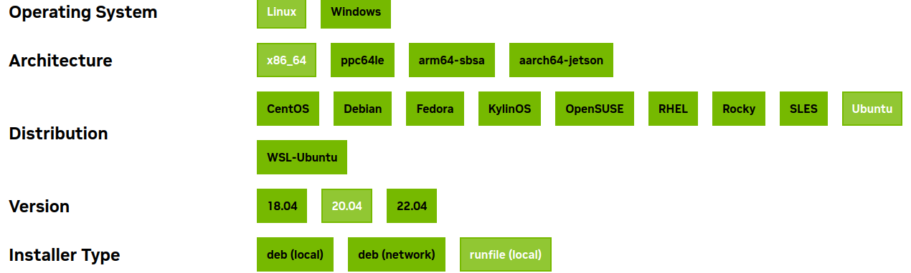
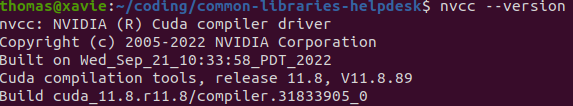
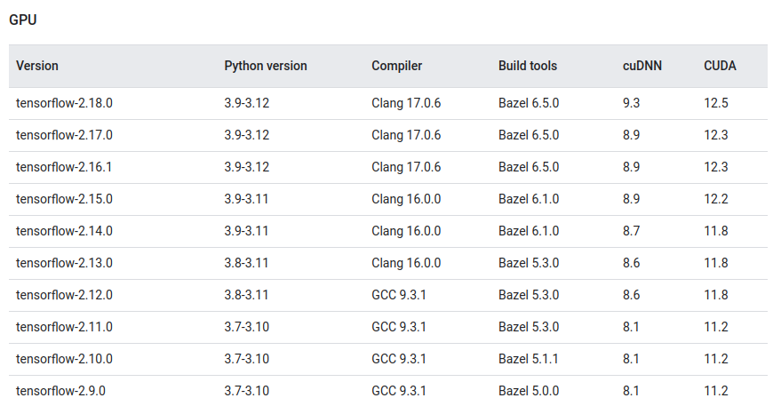

# Common Libraries Helpdesk with typical errors when setting up.
## 1. Anaconda
### Pros and Cons
a. Pros:
- Easy to install packages
- AI/ML oriented
- Isolated environment for each project.

b. Cons:
- Take lots of disk space

### Installation
Install on Ubuntu 20.04. For installing Anaconda:
- In [main Anaconda website](https://docs.anaconda.com/free/anaconda/install/linux/) (recommended)
- Article of Linuxize:  [install-anaconda-ubuntu-20.04](https://linuxize.com/post/how-to-install-anaconda-on-ubuntu-20-04/)   
After installation, refer to check the conda version to make sure successful installation:   
- Sample result: **conda 4.8.2**
```
conda -V
```
- If you'd prefer that conda's base environment not be activated on startup, set the **auto_activate_base** parameter to false.
```
conda config --set auto_activate_base false
```
### Create, activate/deactivate, remove, list virtual envs with anaconda
a. Create conda env
- By default:
```
conda create -n envname
```
- With specific python, packages version
```
conda create -n envname python=3.8 scipy=0.15.0 
```
b. Activate/Deactivate conda env
```
conda activate envname
```
```
conda deactivate
```
c. Remove conda env
```
conda remove -n envname --all
```
d. List conda environments
```
conda info --envs
```
   
e. List all packages installed
```
conda list
```
## 2. Python Venv
- This package is to create an isolated environment for python.
### Installation
- Need to specify a python version to install venv. For instance, to install with python3.8 
```
sudo apt install python3.8-venv
```
### Create and activate
- Create an environment
```
python3 -m venv env_name 
```
- Activate environment
```
source env_name/bin/activate
```
#### Difference between Conda and Pip
- Check this article for reference: [Understanding Conda and pip](https://www.anaconda.com/blog/understanding-conda-and-pip)
- In summary, the table below shows main differences:   


#### Conda and Venv
- [Choose right python environment for you](https://mindthevirt.com/venv-vs-conda-choosing-the-right-python-environment-manager-for-you/)
- **Use venv if your project is built on Python only, otherwise choose Conda for cross-platform projects.**

## 3. CUDA toolkit (#nvidia-smi cuda) and cuDNN
- Tested OS: Ubuntu 20.04
- Full instruction to Install [cuda and cuDNN](https://github.com/ashutoshIITK/install_cuda_cudnn_ubuntu_20). But some command lines are outdated [update Nov'2024].
- [Nvidia-driver](https://github.com/NU-iz-da-fam/ubuntu-installation-helpdesk) should be installed before cuda and cuDNN.
- In my case, I install cuda-11.8

```
wget https://developer.download.nvidia.com/compute/cuda/11.8.0/local_installers/cuda_11.8.0_520.61.05_linux.run
sudo sh cuda_11.8.0_520.61.05_linux.run
```
- When Done, open terminal, export path with your {cuda-version} to *~/.bashrc*
```
echo 'export PATH=/usr/local/cuda-{cuda-version}/bin:$PATH' >> ~/.bashrc
echo 'export LD_LIBRARY_PATH=/usr/local/cuda-{cuda-version}/lib64:$LD_LIBRARY_PATH' >> ~/.bashrc
```
- Or change VERSION, run ```export_cuda.sh``` and source ```.bashrc```
```
bash build/export_cuda.sh
source ~/.bashrc
```
- Check cuda path
```
which nvcc
```
- Check Cuda Toolkit version
```
nvcc --version
```

### Errors:
- Missing [**cudaProfiler.h**](https://forums.developer.nvidia.com/t/pycuda-l4t32-6-1-install-missing-cudaprofiler-h/204834) -> Reinstall cuda toolkit with ```.run``` file

## 4. TensorRT:
- Not sure if this guide is generally correct, but it works in my case.
- Install cuda toolkit first (mandatory). If installing with ```.run``` does not work, try to install with ```.deb```
- ```nv-tensorrt-local-repo-2004-8.5.1-cuda-11.8_1.0-1_amd64.deb``` is compatible with cuda 11.x
```
os="ubuntu2004"
tag="8.5.1-cuda-11.8"
sudo dpkg -i nv-tensorrt-local-repo-${os}-${tag}_1.0-1_amd64.deb
sudo cp /var/nv-tensorrt-local-repo-${os}-${tag}/*-keyring.gpg /usr/share/keyrings/
sudo apt-get update
sudo apt-get install tensorrt
```
- If you have tried many versions of tensorrt, it could cause conflicts. So, remove all other before installing.
- Replace ${os} and ${tag} parameters 
```
sudo dpkg -r nv-tensorrt-local-repo-${os}-${tag}_1.0-1_amd64
sudo dpkg --purge nv-tensorrt-local-repo-${os}-${tag}_1.0-1_amd64
```
- Then reinstall. Tensorrt may need ```reboot```
### Errors:
- Lib **libcublas.so** not found -> Reinstall cuda toolkit with ```.deb``` file 🫰

## 5. TensorFlow
- People prefer installing tensorflow in a virtual environment rather than installing directly in native OS. 
- Install python venv.
- Create, activate virtual environment.
```
python3 -m venv tfenv
source tfenv/bin/activate
```
- Upgrade pip version
```
pip install --upgrade pip
```
- Check compatible version of [tensorflow, cuda and cudnn](https://www.tensorflow.org/install/source#gpu) before installing.

- Install [tensorflow GPU](https://www.tensorflow.org/install/pip). Assume my system uses ```cuda==11.8, cudnn==8.6. So I install tensorflow==2.12.0```
```
pip install tensorflow==2.12.0
```
- To check if tensorflow is installed properly, use the command below. Just make sure you use the correct python version.
```
python3.8 -c "import tensorflow as tf; print(tf.__version__)"
```
#### Error: libdevice not found at ./libdevice.10.bc
When this error happens, mean system can not find libdevice in nvvm folder. To solve this:
- Type "whereis cuda" command, access the directory, find folder named <strong>nvvm</strong>
- Inside nvvm, it will have libdevice file, copy (search path using <strong>pwd</strong>) and paste into a new <strong>nvvm</strong> folder at your current dir.   
Below commands are orderly for searching cuda dir, copying file. The cuda_nvvm_dir will be often <strong>/usr/lib/cuda</strong>
```
whereis cuda
```
```
sudo cp [cuda_nvvm_dir] [your_current_working_dir]
```
For reference link: https://stackoverflow.com/questions/72499414/i-got-an-error-about-error-cant-find-libdevice-directory-cuda-dir-nvvm-libd   
#### Error: do not find Cuda drivers
- Install cuda toolkit with above guide. Ensure the compatibility of tensorflow version and cuda toolkit version.
## 7. PyTorch 
For your reference, I recommend this link: https://varhowto.com/install-pytorch-cuda-10-2/    
After installation, you should check the if Pytorch has been successfully installed
```
python -c "import torch; print(torch.__version__); print(torch.rand(6, 4))"
```
- Check torch version
```
torch.version.cuda
```
- Check Cuda is available
```
torch.cuda.is_available()
```
- Check supported arch list
```
torch.cuda.get_arch_list()
```
#### Error: Cuda error: no kernel image is available for execution on the device   
If this error comes follow a warning: <strong>GPU with CUDA capability sm_86 is not compatible with the current PyTorch installation.</strong> which mean that your pyTorch version needs to be updated. Perhaps it is too old and not compatible with new GPU computation.   
      
To solve this, check https://pytorch.org/get-started/locally/ to install newer version of PyTorch. Or you can try directly the below command if you are working with conda:
```
conda install pytorch torchvision torchaudio pytorch-cuda=11.7 -c pytorch -c nvidia
```
You could also use <strong>pip, libtorch or source </strong> up to your requirement. Then rerun your program. This worked in my case.  
- Another solution is to create again for env with correct python, pip version or update the requirements file. Some of them are outdated or deprecated and need to be udpated with newer version.
