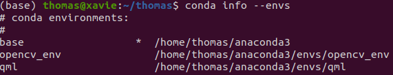
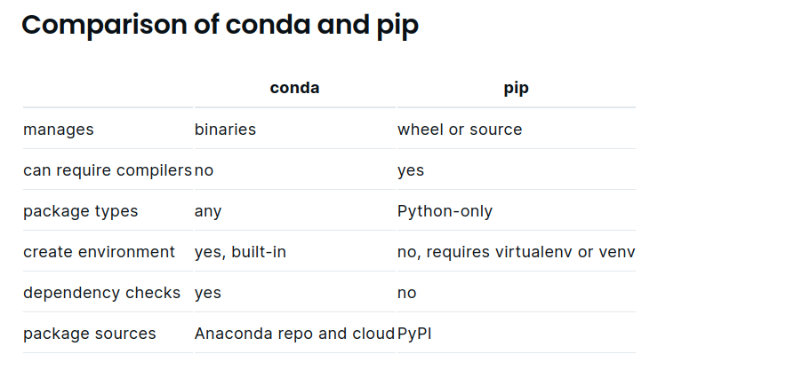
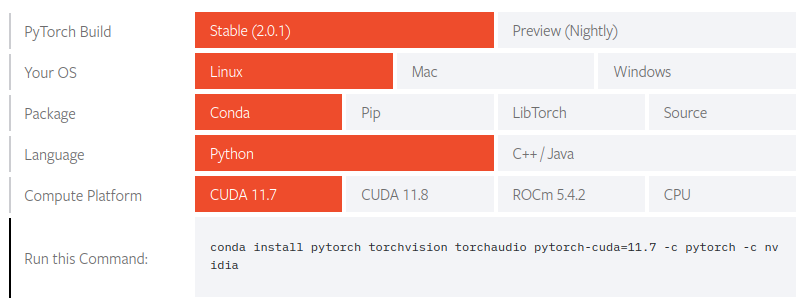

# Common Libraries Helpdesk with typical errors when setting up.
## 1. Anaconda
### Pros and Cons
a. Pros:
- Easy to install packages
- AI/ML oriented
- Isolated environment for each project.

b. Cons:
- Take lots of disk space

### Installation
Install on Ubuntu 20.04. For installing Anaconda, we have lots of specific guides on the internet. I recommend the article of Linuxize:   
https://linuxize.com/post/how-to-install-anaconda-on-ubuntu-20-04/   
After installation, refer to check the conda version to make sure successful installation:   
- Sample result: **conda 4.8.2**
```
conda -V
```
- If you'd prefer that conda's base environment not be activated on startup, set the **auto_activate_base** parameter to false.
```
conda config --set auto_activate_base false
```
### Create, activate/deactivate, remove, list virtual envs with anaconda
a. Create conda env
- By default:
```
conda create -n envname
```
- With specific python, packages version
```
conda create -n envname python=3.8 scipy=0.15.0 
```
b. Activate/Deactivate conda env
```
conda activate envname
```
```
conda deactivate
```
c. Remove conda env
```
conda remove -n envname --all
```
d. List conda environments
```
conda info --envs
```
   
e. List all packages installed
```
conda list
```
## 2. Python Venv
- This package is to create an isolated environment for python.
### Installation
- Need to specify a python version to install venv. For instance, to install with python3.8 
```
sudo apt install python3.8-venv
```
### Create and activate
- Create an environment
```
python3 -m venv env_name 
```
- Activate environment
```
source env_name/bin/activate
```
#### Difference between Conda and Pip
- Check this article for reference: https://www.anaconda.com/blog/understanding-conda-and-pip
- In summary, the table below shows main differences:   


#### Conda and Venv
- https://mindthevirt.com/venv-vs-conda-choosing-the-right-python-environment-manager-for-you/
- Use venv if your project is built on Python only, otherwise choose Conda for cross-platform projects.
## 3. OpenCV
Install on Ubuntu 20.04
```
sudo apt update
sudo apt install libopencv-dev python3-opencv
```
After installing, if default python version and python version supported by OpenCV are different, this will lead to a problem   
<strong>Error: ModuleNotFoundError: No module named 'cv2' </strong>. To solve this, check your python version first. Open terminal.
```
python3 --version
```
Check the python version supported by OpenCV using the command below. If there are more than 1 python version, maybe your opencv was installed with the left python version.
```
ls /usr/bin/python*
```
In this case, test with other python version, assumed we have version 3.7. Use below command and you will see OpenCV version. 
```
python3.7 -c "import cv2; print(cv2.__version__)"
```
#### Alias to set specific python version as default
If you use OpenCV many times, you will need to set python version supported by OpenCV as default. To do this with example <strong>python3.7</strong>, open .bashrc file
```
sudo gedit ~/.bashrc
```
At the end of file. Type the command and then Save. <strong>DONE</strong>
```
alias python=python3.7
```
If installing OpenCV with Anaconda, should consider combination of python3.7 and openCV. Because sometimes, python3.8 faces the error <strong>CV2:ModuleNotFound</strong>.
- You could check directly here: https://saturncloud.io/blog/anaconda-solving-the-cannot-import-cv2-issue-even-though-opencv-is-installed-how-to-install-opencv3-for-python3/
```
conda create -n opencv_env python=3.7
conda activate opencv_env
```
```
conda install -c conda-forge opencv 
```
- Check if openCV has been installed properly.   
```
python3.7 -c "import cv2; print(cv2.__version__)"
```

## 4. TensorFlow
Of courses, we should refer the official link on tensorflow website. In this guideline, try to solve some problems facing after installation.   
Link: https://www.tensorflow.org/install/pip   
- To check if tensorflow is installed properly, use the command below. Just make sure you use the correct python version.
```
python3.8 -c "import tensorflow as tf; print(tf.__version__)"
```
#### Error: libdevice not found at ./libdevice.10.bc
When this error happens, mean system can not find libdevice in nvvm folder. To solve this:
- Type "whereis cuda" command, access the directory, find folder named <strong>nvvm</strong>
- Inside nvvm, it will have libdevice file, copy (search path using <strong>pwd</strong>) and paste into a new <strong>nvvm</strong> folder at your current dir.   
Below commands are orderly for searching cuda dir, copying file. The cuda_nvvm_dir will be often <strong>/usr/lib/cuda</strong>
```
whereis cuda
```
```
sudo cp [cuda_nvvm_dir] [your_current_working_dir]
```
- Check Cuda Toolkit version
```
nvcc --version
```
For reference link: https://stackoverflow.com/questions/72499414/i-got-an-error-about-error-cant-find-libdevice-directory-cuda-dir-nvvm-libd   
## 5. PyTorch 
For your reference, I recommend this link: https://varhowto.com/install-pytorch-cuda-10-2/    
After installation, you should check the if Pytorch has been successfully installed
```
python -c "import torch; print(torch.__version__); print(torch.rand(6, 4))"
```
- Check torch version
```
torch.version.cuda
```
- Check Cuda is available
```
torch.cuda.is_available()
```
- Check supported arch list
```
torch.cuda.get_arch_list()
```
#### Error: Cuda error: no kernel image is available for execution on the device   
If this error comes follow a warning: <strong>GPU with CUDA capability sm_86 is not compatible with the current PyTorch installation.</strong> which mean that your pyTorch version needs to be updated. Perhaps it is too old and not compatible with new GPU computation.   
      
To solve this, check https://pytorch.org/get-started/locally/ to install newer version of PyTorch. Or you can try directly the below command if you are working with conda:
```
conda install pytorch torchvision torchaudio pytorch-cuda=11.7 -c pytorch -c nvidia
```
You could also use <strong>pip, libtorch or source </strong> up to your requirement. Then rerun your program. This worked in my case.  
- Another solution is to create again for env with correct python, pip version or update the requirements file. Some of them are outdated or deprecated and need to be udpated with newer version.

## 6. Docker
### Installation
### Setup builder
### Run helloworld
### Docker with sudo
